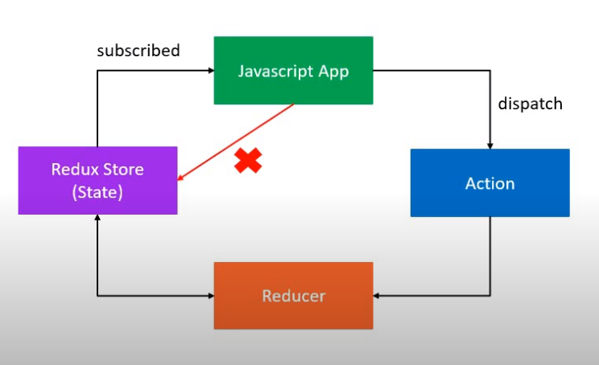

# Redux

Redux concepts

## Three core concepts

**store** , **action**, **reducer**

A **store** that holds the state of an application.
An **action** that describes the changes in the state of the application.
A **reducer** which actually carries out the state transition depending on the action type.

## Three Principles

### First Principle

**_The state of your whole application is stored in an object tree withing a single store_**

Maintain our application state in a single object which would be managed by Redux store

```
{
    availableCars: 100
}
```

### Second Principle

**_The only way to change the state is to emit an action, action is an object describing what happened_**

To update the state of your app you need to let Redux know about that with an action
You are not allowed to directly update the state object

```
{
    type: BUY_CAR
}
```

### Third Principle

**_To specify how the state tree is transformed by actions, you need to write pure reducers_**

Reducer => (prevState, action) => newState

```
const reducer = (state, action) => {
    switch(action.type){
        case BUY_CAR: return {
            ...state,
            availableCars: state.availableCars - 1
        }
    }
}
```

## Three Principles Overview


